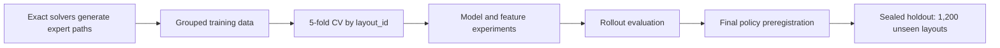

# Robot Delivery Route Ensemble

> Exact route optimization meets machine-learning policy design — evaluated with a preregistered sealed holdout.

## Overview

This portfolio page summarizes a Kaggle-style robot-delivery project conducted in a private development repository. The task is to navigate an 8×8 grid, pick up an item, and deliver it while minimizing path length and avoiding cycles or timeouts.

The project compares exact solvers with imitation-learning policies, then combines the strongest models into a rollout-tested ensemble. This public repository intentionally contains no competition data, trained weights, private source code, or team-internal artifacts.

## What I worked on

- Compared six exact solvers: BFS, bidirectional BFS, reverse BFS, min-cost flow, MILP, and CP-SAT.
- Trained and evaluated eight model families, including logistic regression, Extra Trees, CatBoost, XGBoost, and LightGBM.
- Designed layout-grouped cross-validation to prevent samples from the same map leaking across folds.
- Separated teacher-forced metrics from end-to-end rollout metrics.
- Added agent-relative wall features, probability ensembles, and a cycle-avoidance decoder.
- Preregistered the final policy, evaluator, and data hash before opening the sealed holdout.

## Evaluation design

| Split | Layouts | Episodes | Expert action samples |
|---|---:|---:|---:|
| Train | 100 | 400 | 5,327 |
| Validation | 50 | 200 | 2,654 |
| Test | 400 | 1,600 | 21,006 |
| Sealed holdout | 1,200 | 4,800 | 62,365 |

## Results

### Final sealed holdout

| Metric | Result |
|---|---:|
| Delivery success | **4,800 / 4,800 (100%)** |
| Layouts with all episodes successful | **1,200 / 1,200** |
| Shortest-path success | **4,535 / 4,800 (94.4792%)** |
| Timeouts | **0** |
| Mean normalized regret | **0.028606** |
| Development-to-holdout gap | **0.5833 percentage points** |

The final holdout was not used for further tuning after the result was viewed.

### Search-efficiency benchmark

Bidirectional BFS was compared with standard BFS on 400 trajectories after five warm-up runs and 50 measured rounds.

| Metric | Reduction vs. BFS |
|---|---:|
| Expanded nodes | **42.7368%** |
| Generated nodes | **26.8160%** |
| Median runtime | **approximately 3.93%** |

The node-count improvement is substantial, but the measured latency gain is modest. These metrics are therefore reported separately rather than described as a broad system-resource saving.

## Engineering quality

- **114 automated tests** passing across 25 test files.
- **24 documented experiments** from baseline through the final holdout.
- All six exact solvers agreed on optimal cost for every reachable state in a 3×3 exhaustive validation: **6,792 reachable cases out of 9,216 total cases**.
- Observation replay matched all **5,327 / 5,327** state samples with zero vector mismatch.

## Key learning

High offline classification accuracy did not guarantee strong rollout performance. For example, a model could predict expert actions accurately under teacher forcing yet enter cycles when its own previous action changed the next state. I therefore treated grouped OOF metrics and end-to-end rollout success as complementary—not interchangeable—evaluation layers.

## Scope and limitations

- Results come from a finite synthetic 8×8 environment, not a physical robot fleet.
- Delivery success must not be interpreted as production reliability, operational cost savings, or real-world safety performance.
- Search-node reductions do not directly equal CPU, memory, or cloud-cost reductions.
- The private source repository can be reviewed separately when appropriate.

## Resume-ready summary

> Combined exact route search with an imitation-learning ensemble for an 8×8 robot-delivery environment, then validated the preregistered policy on 4,800 sealed-holdout episodes, achieving 100% delivery success, 94.48% shortest-path success, and zero timeouts. A bidirectional BFS benchmark reduced expanded nodes by 42.7% and generated nodes by 26.8% versus standard BFS.

---

This repository is a sanitized portfolio summary. It does not contain the original dataset, private implementation, or trained model artifacts.
